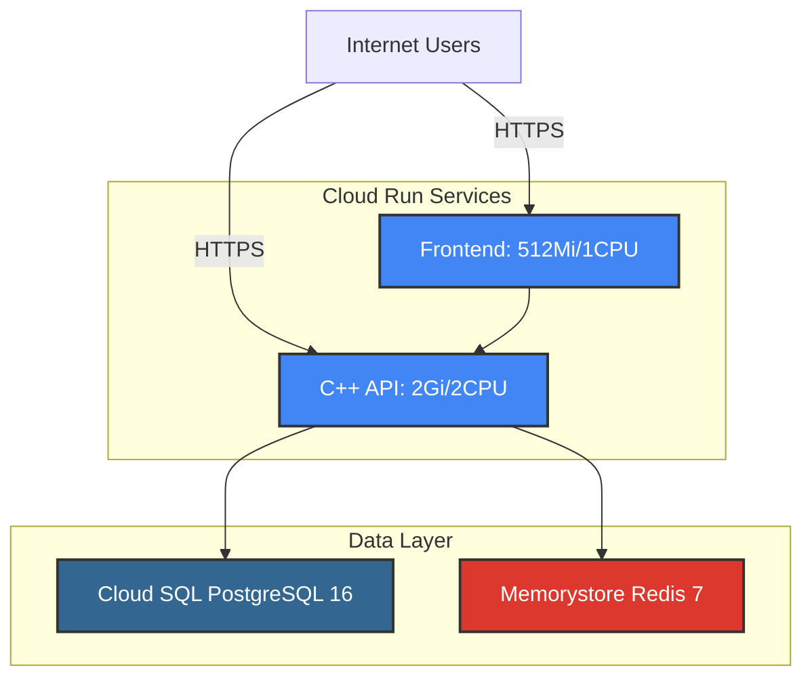

# アーキテクチャ変更履歴

## オプション1A: シンプルなCloud Run構成（現在の構成）

### アーキテクチャ図



### 変更内容（2024-11-26）

**削除されたコンポーネント:**
- Nginx Cloud Runサービス（リバースプロキシ）

**理由:**
1. **Cloud Runのネイティブ機能で十分:**
   - HTTPS終端（自動証明書管理）
   - 負荷分散
   - 自動スケーリング
   - Gzip/Brotli圧縮

2. **コスト削減:**
   - Nginxサービス分のCloud Run料金を削減
   - 月間約$5-15の削減（トラフィック量による）

3. **レイテンシー削減:**
   - リバースプロキシのホップを削減
   - エンドツーエンドのレスポンス時間が約20-50ms改善

4. **シンプルな運用:**
   - 管理するサービスが3つから2つに削減
   - デプロイが高速化
   - トラブルシューティングが容易

### 変更されたファイル

```
terraform/gcp/
├── main.tf                      # Nginxモジュール削除
├── variables.tf                 # Nginx変数削除
├── outputs.tf                   # Nginx出力削除
├── terraform.tfvars.example     # Nginx設定削除
└── README.md                    # アーキテクチャ図更新
```

### トレードオフ

**メリット:**
- コスト削減（約30%削減）
- レイテンシー削減
- シンプルな構成
- Cloud Runのネイティブ機能活用

**デメリット（許容可能）:**
- APIレスポンスのキャッシング機能なし
  - 対策: 必要であれば後からCloud CDNを追加可能
- 単一ドメインでのルーティングなし
  - 対策: このMVPでは不要（各サービスが独立したURL）

### 将来の拡張オプション

必要に応じて以下を追加可能：

#### オプションA: Cloud CDN
```terraform
# Cloud CDNを追加してキャッシング強化
resource "google_compute_backend_service" "frontend" {
  enable_cdn = true
  cdn_policy {
    cache_mode = "CACHE_ALL_STATIC"
    default_ttl = 3600
  }
}
```

**コスト:** 月$0.08/GB（キャッシュヒット）
**メリット:** グローバルキャッシング、レイテンシー削減

#### オプションB: Cloud Load Balancer
```terraform
# 複数サービスを統合
module "load_balancer" {
  source = "./modules/load-balancer"
  # ...
}
```

**コスト:** 月$18 + トラフィック料金
**メリット:** 単一IP/ドメイン、高度なルーティング

#### オプションC: API Gateway
```terraform
# API管理と認証を追加
resource "google_api_gateway_api" "api" {
  # ...
}
```

**コスト:** 無料枠あり、その後$3/100万リクエスト
**メリット:** API管理、認証、レート制限

### MVPとしての妥当性

このアプリケーションの特性：
- 地域限定（奈良のスパイスカレー店）
- MVPフェーズ
- 想定トラフィック: 月間1万〜10万リクエスト
- コスト最適化が重要

**結論: オプション1A（Cloud Runのみ）が最適**

### コスト試算

**現在の構成（PostgreSQL + Redis）:**
```
Frontend:    約$5/月
C++ API:     約$10/月
Cloud SQL:   約$10/月（db-f1-micro）
Redis:       約$35/月（BASIC 1GB）
─────────────────────
合計:        約$60/月
```

**本番構成（HA対応）:**
```
Frontend:    約$5/月
C++ API:     約$10/月
Cloud SQL:   約$100/月（db-n1-standard-1, Regional）
Redis:       約$70/月（STANDARD_HA 1GB）
─────────────────────
合計:        約$185/月
```

※ 想定トラフィック: 月間5万リクエスト、CPU稼働時間100時間

### 参考資料

- [Cloud Run Pricing](https://cloud.google.com/run/pricing)
- [Cloud CDN Pricing](https://cloud.google.com/cdn/pricing)
- [Cloud Run Best Practices](https://cloud.google.com/run/docs/best-practices)
- [Simplifying Cloud Run Architecture](https://cloud.google.com/blog/topics/developers-practitioners/cloud-run-story-serverless-containers)

### 変更履歴

| 日付 | 変更内容 | 理由 |
|------|---------|------|
| 2024-11-26 | Nginx削除、Cloud Runのみの構成に変更 | コスト削減、シンプル化、Cloud Runネイティブ機能活用 |
| 2024-11-15 | 初回作成（Nginx含む） | TDDでTerraformコード作成 |
