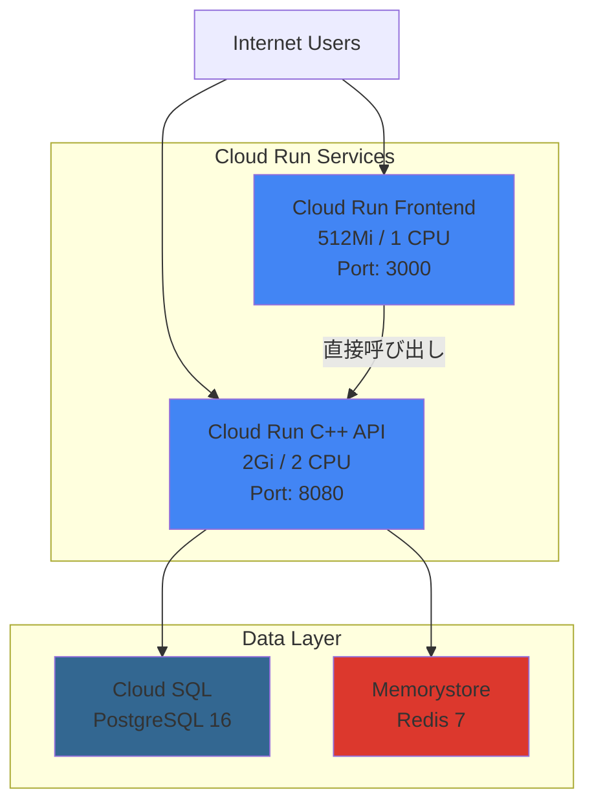

# Spice Road - GCP Terraform Infrastructure

このディレクトリには、Spice Road MVPアプリケーションをGoogle Cloud Platform（GCP）上にデプロイするためのTerraform Infrastructure as Code（IaC）が含まれています。

## アーキテクチャ



**シンプルな2層構成:**
- FrontendがC++ APIを直接呼び出し
- 各サービスが独立したCloud Runエンドポイント
- Cloud Runのネイティブ機能（HTTPS、負荷分散、自動スケーリング）を活用

## デプロイされるリソース

- **Artifact Registry**: Dockerイメージの保存
- **Cloud Run Services**:
  - C++ API Service (2Gi メモリ, 2 CPU)
  - Frontend Service (512Mi メモリ, 1 CPU)
- **Cloud SQL**: PostgreSQL 16 データベース
- **Memorystore**: Redis 7 キャッシュ
- **IAM**:
  - Cloud Run用サービスアカウント
  - デプロイ用サービスアカウント
  - Workload Identity Federation (GitHub Actions用)

**Nginxを削除した理由:**
- Cloud Runが既にHTTPS終端、負荷分散、圧縮を提供
- コスト削減（1サービス分の料金削減）
- レイテンシー削減（リバースプロキシのホップを削減）
- シンプルな構成で運用が容易

## 前提条件

### ツール

1. **asdf** - バージョン管理ツール（推奨）
   - または手動でTerraform >= 1.6.6 をインストール
2. **Google Cloud SDK (`gcloud`)** - GCP CLI
3. **GCPプロジェクト** - アクティブなプロジェクトと適切な権限

### インストール

#### asdfとTerraformのセットアップ

```bash
# asdfをインストール（未インストールの場合）
git clone https://github.com/asdf-vm/asdf.git ~/.asdf --branch v0.14.0

# シェル設定に追加
echo '. "$HOME/.asdf/asdf.sh"' >> ~/.bashrc  # bash の場合
# または
echo '. "$HOME/.asdf/asdf.sh"' >> ~/.zshrc   # zsh の場合

# シェルを再起動
source ~/.bashrc  # または source ~/.zshrc

# プロジェクトルートに移動
cd /path/to/spice-road-mvp

# Terraformプラグインを追加
asdf plugin add terraform https://github.com/asdf-community/asdf-hashicorp.git

# .tool-versions に定義されたバージョンをインストール
asdf install

# 確認
terraform version  # Should show: Terraform v1.6.6
```

**参考**:
- [asdf公式サイト](https://asdf-vm.com/)
- [asdf-hashicorp プラグイン](https://github.com/asdf-community/asdf-hashicorp)

#### GCP認証

```bash
# gcloud認証
gcloud auth login
gcloud auth application-default login

# プロジェクトIDを設定
gcloud config set project your-gcp-project-id
```

**参考**: [Authentication for Terraform | Google Cloud](https://cloud.google.com/docs/terraform/authentication)

## クイックスタート

### 1. 環境変数ファイルの作成（.env）

```bash
cd terraform/gcp

# .env.example をコピー
cp .env.example .env

# エディタで編集
nano .env
```

**.env の最小設定**:

```bash
# GCP認証（gcloud CLI使用の場合はコメントアウト）
# export GOOGLE_APPLICATION_CREDENTIALS="/path/to/service-account-key.json"

# GCPプロジェクト設定（必須）
export GOOGLE_PROJECT="your-gcp-project-id"
export GOOGLE_REGION="asia-northeast1"

# Terraform stateバケット（必須）
# 先に ./scripts/create-state-bucket.sh で作成してください
export TF_BACKEND_BUCKET="your-gcp-project-id-terraform-state"
```

**注意**: 各変数には`export`プレフィックスが付いているため、`source .env`だけで環境変数として読み込めます。

**参考**:
- [Authentication for Terraform | Google Cloud](https://cloud.google.com/docs/terraform/authentication)
- [Google Cloud Provider Configuration Reference](https://registry.terraform.io/providers/hashicorp/google/latest/docs/guides/provider_reference)

### 2. Terraform変数ファイルの作成

```bash
# terraform.tfvars.example をコピー
cp terraform.tfvars.example terraform.tfvars

# エディタで編集
nano terraform.tfvars
```

**最小設定**:

```hcl
project_id = "your-gcp-project-id"
region     = "asia-northeast1"
environment = "prod"
app_name = "spice-road"

# オプション1: Cloud Buildで自動ビルド（推奨）
enable_cloud_build = true
github_repository = "your-username/spice-road-mvp"
git_ref = "main"  # ビルドするブランチ/タグ/コミット

# オプション2: 手動でDockerイメージを指定
# enable_cloud_build = false
# cpp_api_image  = "asia-northeast1-docker.pkg.dev/PROJECT_ID/REPO/cpp-api:latest"
# frontend_image = "asia-northeast1-docker.pkg.dev/PROJECT_ID/REPO/frontend:latest"

# 認証なしアクセスを許可（公開アプリの場合）
allow_unauthenticated = true
```

### 3. Terraform stateバケットの作成

```bash
# 初回のみ: stateバケットを作成
./scripts/create-state-bucket.sh

# 作成されたバケット名を.envに追加
# TF_BACKEND_BUCKET="your-gcp-project-id-terraform-state"
```

### 4. Terraformの初期化

```bash
# ラッパースクリプトを使用（.envを自動読み込み）
./scripts/tf-init.sh

# または直接実行（source .envで環境変数がエクスポートされます）
source .env
terraform init -backend-config="bucket=$TF_BACKEND_BUCKET"
```

### 5. プランの確認

```bash
# ラッパースクリプトを使用
./scripts/tf-plan.sh

# または直接実行
source .env
terraform plan -var="project_id=$GOOGLE_PROJECT"
```

### 6. インフラのデプロイ

#### オプション1: Cloud Buildで自動ビルド（推奨）

`enable_cloud_build = true` に設定した場合、`terraform apply` 実行時に：

1. **インフラストラクチャを作成** (Cloud SQL, Redis, Artifact Registry等)
2. **GitHubからソースコードをpull**してCloud Buildでビルド
3. **Dockerイメージ**をArtifact Registryにプッシュ
4. **Cloud Runサービス**を自動的にデプロイ

```bash
# terraform.tfvarsで設定
enable_cloud_build = true
github_repository = "TamichiRyuto/spice-road-mvp"
git_ref = "main"

# デプロイ実行（すべて自動）
./scripts/tf-apply.sh
```

**メリット**:
- ✅ 1回の`terraform apply`で完全なデプロイ
- ✅ Dockerビルド環境不要（Cloud Buildがビルド）
- ✅ GitHubのコードから直接デプロイ
- ✅ インフラとアプリの順序を自動管理

#### オプション2: 手動でDockerイメージを指定

`enable_cloud_build = false` の場合、2段階デプロイ：

**ステップ1**: インフラのみデプロイ
```bash
# terraform.tfvarsで設定
enable_cloud_build = false
cpp_api_image  = ""
frontend_image = ""

# インフラのみデプロイ
./scripts/tf-apply.sh
```

**ステップ2**: Dockerイメージをビルド・プッシュして再デプロイ
```bash
# 手動でDockerイメージをビルド・プッシュ
gcloud builds submit --tag=REGISTRY_URL/cpp-api:latest ./cpp-api
gcloud builds submit --tag=REGISTRY_URL/frontend:latest ./frontend

# terraform.tfvarsを更新
cpp_api_image  = "asia-northeast1-docker.pkg.dev/PROJECT_ID/REPO/cpp-api:latest"
frontend_image = "asia-northeast1-docker.pkg.dev/PROJECT_ID/REPO/frontend:latest"

# Cloud Runサービスをデプロイ
./scripts/tf-apply.sh
```

### 7. デプロイの確認

```bash
# 出力値を表示
terraform output

# FrontendのURLを取得（メインエントリーポイント）
terraform output frontend_service_url

# ブラウザでアクセス
open $(terraform output -raw frontend_service_url)
```

### 詳細なデプロイ手順

詳細な手順については [DEPLOYMENT.md](DEPLOYMENT.md) を参照してください。

## テスト（TDD）

このTerraformコードはTest-Driven Development (TDD)で作成されています。

### テストの実行

```bash
# すべてのテストを実行
cd terraform/gcp
bash tests/terraform_validate_test.sh
```

### テストの内容

1. **構文チェック**: すべての必要なファイルが存在するか
2. **フォーマットチェック**: Terraformコードが正しくフォーマットされているか
3. **初期化テスト**: `terraform init`が成功するか
4. **検証テスト**: `terraform validate`が成功するか
5. **モジュール構造チェック**: すべてのモジュールが存在するか
6. **セキュリティチェック**: ハードコードされた認証情報がないか

## モジュール構造

```
terraform/gcp/
├── main.tf                 # メイン設定
├── variables.tf            # 変数定義
├── outputs.tf              # 出力値
├── versions.tf             # プロバイダーバージョン
├── .env                    # 環境変数（ユーザーが作成、gitignore済み）
├── .env.example            # 環境変数テンプレート
├── terraform.tfvars        # 変数値（ユーザーが作成）
├── terraform.tfvars.example # 変数値テンプレート
├── DEPLOYMENT.md           # 詳細デプロイ手順
├── ARCHITECTURE.md         # アーキテクチャ変更履歴
├── TESTING.md              # テスト実行ガイド
├── scripts/
│   ├── create-state-bucket.sh  # Terraform state用GCSバケット作成
│   ├── tf-init.sh              # Terraform初期化ラッパー
│   ├── tf-plan.sh              # Terraformプランラッパー
│   ├── tf-apply.sh             # Terraform適用ラッパー
│   └── tf-destroy.sh           # Terraform削除ラッパー
├── modules/
│   ├── artifact-registry/  # Artifact Registryモジュール
│   ├── cloud-run/         # Cloud Runモジュール
│   ├── cloud-sql/         # Cloud SQL (PostgreSQL)モジュール
│   ├── memorystore/       # Memorystore (Redis)モジュール
│   └── iam/               # IAMモジュール
├── tests/
│   ├── terraform_validate_test.sh  # バリデーションテスト
│   └── terratest/                  # Terratest用（将来）
└── docs/
    └── adr/
        └── 001-cloudflare-cdn-adoption.md  # ADR: Cloudflare CDN採用
```

## 変数

### 必須変数

- `project_id`: GCPプロジェクトID

### オプション変数

| 変数名 | デフォルト値 | 説明 |
|--------|-------------|------|
| `region` | `asia-northeast1` | デプロイ先のGCPリージョン |
| `environment` | `prod` | 環境名 (dev, staging, prod) |
| `cpp_api_memory` | `2Gi` | C++ APIのメモリ割り当て |
| `cpp_api_cpu` | `2` | C++ APIのCPU割り当て |
| `allow_unauthenticated` | `true` | 認証なしアクセスを許可 |
| `github_repository` | `""` | GitHub Actions用リポジトリ |

詳細は[variables.tf](variables.tf)を参照してください。

## 出力値

デプロイ後、以下の情報が出力されます：

```bash
terraform output
```

- `frontend_service_url`: FrontendのURL（**メインエントリーポイント**）
- `cpp_api_service_url`: C++ APIのURL
- `artifact_registry_repository_url`: Docker imageのpush先URL
- `cloud_sql_instance_name`: Cloud SQLインスタンス名
- `cloud_sql_connection_name`: Cloud SQL接続名
- `redis_host`: Redisホスト
- `redis_port`: Redisポート
- `service_account_email`: Cloud Run用サービスアカウント
- `workload_identity_provider`: GitHub Actions用Workload Identity Provider

**アクセス方法:**
```bash
# FrontendのURLを取得（これがメインのエントリーポイント）
terraform output frontend_service_url

# ブラウザでアクセス
open $(terraform output -raw frontend_service_url)
```

## GitHub Actions統合

GitHub ActionsでCI/CDを設定する場合：

1. Terraformで作成されたWorkload Identity Providerを使用
2. GitHub Secretsに以下を設定:
   - `GCP_PROJECT_ID`
   - `GCP_WORKLOAD_IDENTITY_PROVIDER` (terraform outputから取得)
   - `GCP_SERVICE_ACCOUNT` (terraform outputから取得)

## 手動デプロイ（Terraformなし）

Terraformを使わずに手動でデプロイする場合は、[DEPLOYMENT.md](../../DEPLOYMENT.md)を参照してください。

## トラブルシューティング

### API有効化エラー

```bash
# 必要なAPIを手動で有効化
gcloud services enable \
  run.googleapis.com \
  cloudbuild.googleapis.com \
  artifactregistry.googleapis.com \
  sqladmin.googleapis.com \
  redis.googleapis.com \
  iam.googleapis.com
```

### 権限エラー

```bash
# 現在のユーザーに必要な権限があるか確認
gcloud projects get-iam-policy $PROJECT_ID \
  --flatten="bindings[].members" \
  --format="table(bindings.role)" \
  --filter="bindings.members:user:YOUR_EMAIL"
```

### ステートファイルの問題

```bash
# ステートファイルをリフレッシュ
terraform refresh

# ステートファイルを表示
terraform show
```

## ヘルパースクリプト

環境変数を自動的にロードするラッパースクリプトが用意されています：

### 使用可能なスクリプト

```bash
# Terraform state用GCSバケットを作成（初回のみ）
./scripts/create-state-bucket.sh

# Terraform初期化（.envから環境変数をロード）
./scripts/tf-init.sh -backend-config="bucket=YOUR_PROJECT_ID-terraform-state"

# プラン確認（安全な読み取り専用操作）
./scripts/tf-plan.sh

# インフラ適用（変更を実行、確認プロンプトあり）
./scripts/tf-apply.sh

# インフラ削除（全リソース削除、厳重な確認プロンプトあり）
./scripts/tf-destroy.sh
```

### スクリプトの機能

- `.env`ファイルを`source`で読み込み（`export`付き変数を自動エクスポート）
- 必要な環境変数の検証
- GCPプロジェクト情報の表示
- 安全確認プロンプト（apply/destroy時）
- カラー出力でわかりやすい

## クリーンアップ

すべてのリソースを削除する場合：

```bash
# ラッパースクリプトを使用（推奨）
./scripts/tf-destroy.sh

# または直接実行
source .env
terraform destroy -var="project_id=$GOOGLE_PROJECT"
```

**警告**: これにより、すべてのCloud Runサービス、Cloud SQL、Redis、IAMリソースが削除されます。

## コスト見積もり

Cloud Runは使用量ベースの課金です：

- **最小インスタンス数 = 0**: リクエストがない場合、ほぼ無料
- **リクエスト課金**: 100万リクエストあたり約$0.40
- **メモリ/CPU課金**: 使用した分だけ課金
- **Cloud SQL**: db-f1-micro（開発）約$10/月、db-n1-standard-1（本番）約$100/月
- **Memorystore (Redis)**: BASIC 1GB 約$35/月

詳細: https://cloud.google.com/run/pricing

## セキュリティ考慮事項

- すべてのサービスはHTTPS経由でのみアクセス可能
- サービスアカウントは最小権限の原則に従って設定
- Workload Identity Federationでキー不要の認証
- Cloud SQLはSSL/TLS接続を使用
- Cloud SQL Proxy経由でセキュアな接続
- **Cloud SQLパスワードはSecret Managerで自動生成・管理**

## シークレット管理（Secret Manager）

Cloud SQLのパスワードはTerraformによって自動生成され、Google Secret Managerに保存されます。

### パスワードの確認

デプロイ後にパスワードを確認する場合：

```bash
# シークレットIDを取得
terraform output cloud_sql_password_secret_id

# パスワードを表示
gcloud secrets versions access latest \
  --secret="$(terraform output -raw cloud_sql_password_secret_id)" \
  --project="$GOOGLE_PROJECT"
```

### パスワードのローテーション

パスワードを変更する場合：

```bash
# 1. 新しいパスワードを生成してSecret Managerに追加
gcloud secrets versions add $(terraform output -raw cloud_sql_password_secret_id) \
  --data-file=- <<< "$(openssl rand -base64 24)"

# 2. Terraformを再適用してCloud SQLとCloud Runを更新
terraform apply
```

**注意**: `terraform apply`を実行すると、Terraformが新しいランダムパスワードを生成し、すべてのリソースが更新されます。

### パスワードの固定（変更を防ぐ）

Terraformの`random_password`リソースは`lifecycle`設定で変更を防げます。
必要に応じて`main.tf`の`random_password`リソースに以下を追加：

```hcl
resource "random_password" "cloud_sql_password" {
  # ... existing config ...

  lifecycle {
    ignore_changes = all
  }
}
```

### Secret Managerのアクセス権限

Cloud Runサービスアカウントには、Secret Managerへのアクセス権限が自動的に付与されます。
手動でアクセスする場合は、`Secret Manager Secret Accessor`ロールが必要です。

```bash
# 特定のユーザーにアクセス権限を付与
gcloud secrets add-iam-policy-binding $(terraform output -raw cloud_sql_password_secret_id) \
  --member="user:your-email@example.com" \
  --role="roles/secretmanager.secretAccessor" \
  --project="$GOOGLE_PROJECT"
```

## 参考資料

### GCP & Terraform

- [Google Cloud Run Documentation](https://cloud.google.com/run/docs)
- [Terraform Google Provider](https://registry.terraform.io/providers/hashicorp/google/latest/docs)
- [Authentication for Terraform | Google Cloud](https://cloud.google.com/docs/terraform/authentication)
- [Google Cloud Provider Configuration Reference](https://registry.terraform.io/providers/hashicorp/google/latest/docs/guides/provider_reference)
- [Workload Identity Federation](https://cloud.google.com/iam/docs/workload-identity-federation)

### バージョン管理 (asdf)

- [asdf公式サイト](https://asdf-vm.com/)
- [asdf-hashicorp プラグイン](https://github.com/asdf-community/asdf-hashicorp)
- [Managing Multiple Tool Versions with asdf](https://schoenwald.aero/posts/2025-02-20_managing-multiple-tool-versions/)

### ベストプラクティス

- [Build Production-Ready Google Cloud Infrastructure with Terraform in 2025](https://dev.to/livingdevops/build-production-ready-google-cloud-infrastructure-with-terraform-in-2025-1jj7)
- [Terraform GCP Provider: 5 Best Practices from Real Projects](https://controlmonkey.io/resource/terraform-gcp-provider-best-practices/)

## ライセンス

[プロジェクトのライセンスに従う]
